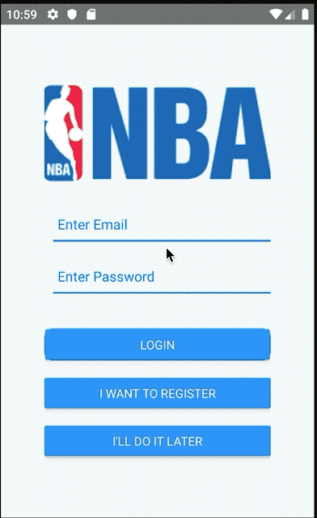

NBA App
===================
<p align="center"></p>
<p align="center">
<a href="#" rel="nofollow"></a>
</p>

## NBA App
NBA App is mobile application IoS &amp; Android to manage video NBA
```
Login / Register
News
Games Video
```

## Architecture
React Native

## Library Used
- React Native
- Font Roboto & IonIcons
- Firebase

## Running
- Clone this repository
- Edit misc.example to misc.js in path of ``` /nba_app/app/components/utils/misc.example ```
  Change FIREBASEURL and APIKEY in misc.js with your firebase 
- ``` npm install ```
- ``` react-native run-ios ```
- ``` react-native run-android ```

## Testing
- IOS 13.3
- Android PIE 

## Preview
